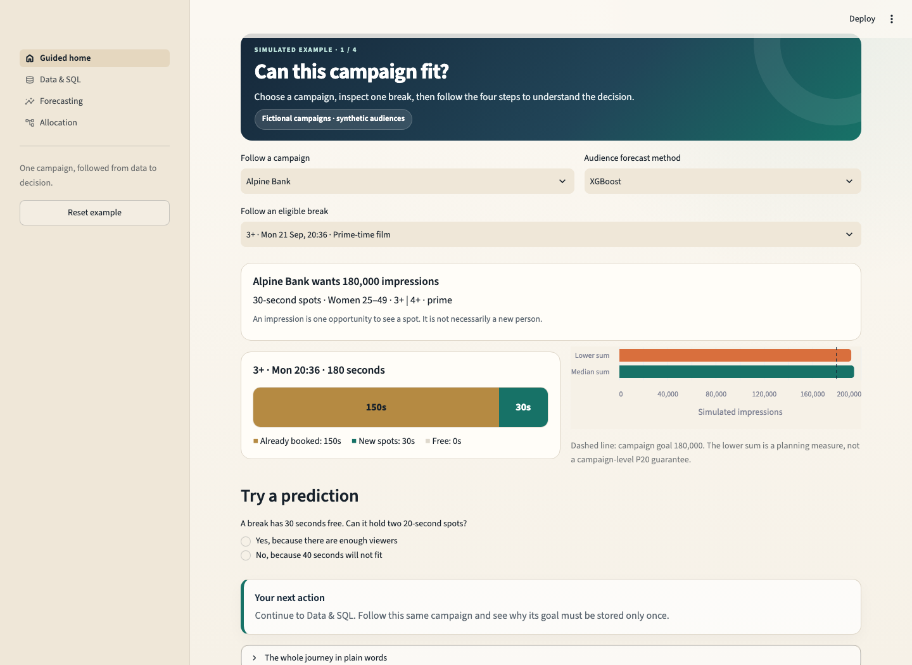
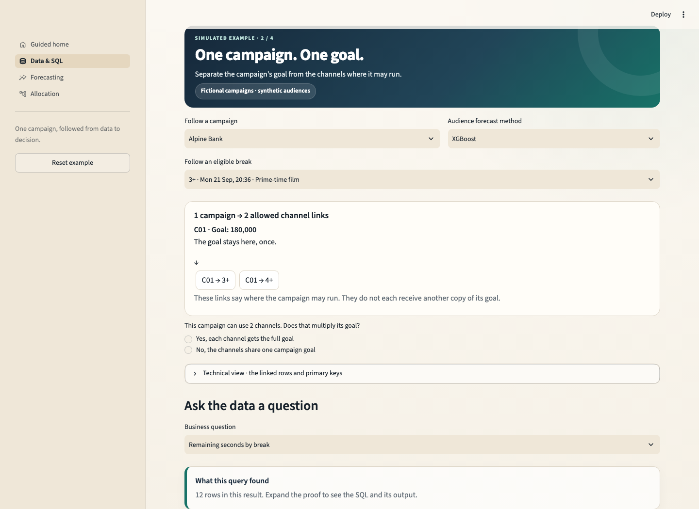
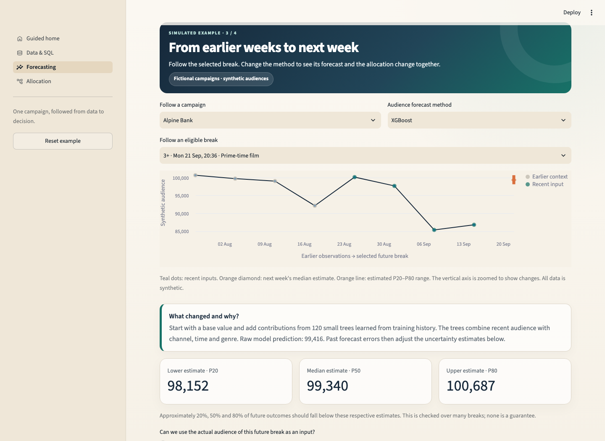
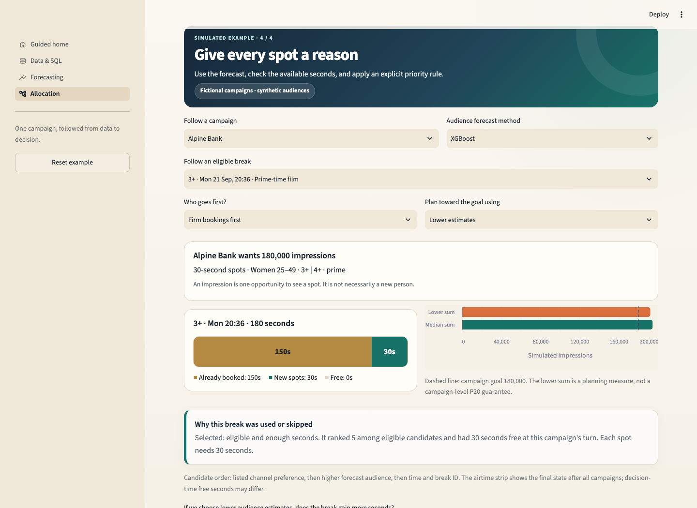

# Sellable Inventory Lab

A small, interactive learning product for television audience forecasting and spot allocation.

Choose one fictional campaign and follow it through four pages. The selected campaign, break, model and priority policy stay with you as you move between pages.

## The learning journey

1. **Guided home:** inspect a campaign goal and a television break's limited seconds.
2. **Data & SQL:** see why channel links do not multiply a goal, run read-only SQL, and deliberately introduce a data error.
3. **Forecasting:** trace earlier observations into next week's forecast and follow an actual fitted XGBoost tree.
4. **Allocation:** inspect seconds used, compare policies, and read why a break was selected or skipped.

Short explanations and visuals appear first. Detailed tables, model settings and SQL are expandable.

## What is simulated

The default schedule, historical audiences, campaigns, target-group shares, bookings and delivery results are fictional. The demonstration works without internet.

Programme listings may come from a public source. All commercial inputs, audiences, bookings and allocation results are simulated.

A disabled-by-default adapter can preview publicly accessible listings from [IPTV-EPG.org](https://iptv-epg.org/guides). Public access does not establish reuse rights. Review source terms before enabling it with the environment setting SELLABLE_ENABLE_PUBLIC_SCHEDULE_REFRESH=1. The preview never supplies audience training data or replaces the connected fictional scenario. Invalid or unavailable listings fall back to the fictional grid. Listings are not committed.

## Connected architecture

    Fictional programme schedule
            │  valid, non-overlapping intervals
            ▼
    Breaks with stable programme/position identifiers
            │
            ├── 36 earlier weeks from the same generator
            │       → features known before each Monday
            │       → fitted models + later calibration errors
            ▼
    Versioned forecast per future break
            │  raw prediction + estimated P20 / P50 / P80
            ▼
    Eligibility + available seconds + priority policy
            ▼
    Placements → campaign delivery + decision explanations
            └── normalized in-memory SQLite queries

Changing a model changes forecasts passed to allocation. Changing a priority policy leaves forecasts unchanged.

## Forecasting methodology

The generator uses the same channel, daypart, genre and slot definitions for history and the future demonstration. The first four weeks provide feature warmup. Of the remaining 32 weeks, 22 train model parameters, four calibrate residuals, and six test results. Seeds and schedule dates are fixed.

Each Monday's forecast covers the coming week. Inputs use prior observations of the same slot: previous-week audience, four-week average and recent trend, plus calendar, channel and genre. Observation timestamps must precede issue time. Later weekly forecasts may use earlier completed test weeks; this is a sequence of one-week-ahead evaluations, not a single six-week forecast.

Models:

- Seasonal naïve: copy the same slot from last week.
- Rolling average: average its latest four observations.
- Linear regression: learn additive feature weights.
- XGBoost: learn 120 shallow trees whose contributions add to a base prediction.

Parameters are fitted only on training rows, with no calibration-period refit. Each model's calibration residuals provide the 20th, 50th and 80th percentiles. Adding these to the raw prediction and clipping at zero gives approximate P20, P50 and P80 estimates. The raw squared-error prediction is not automatically a median.

MAE, WAPE and bias evaluate raw predictions. Bias is actual minus predicted. Separate coverage charts evaluate uncertainty. Residuals are pooled across slots; aggregate coverage does not ensure coverage for each channel or programme. A 78% buffer is shown only as an uncalibrated illustration.

Every forecast records model, issue time, training cutoff and calibration period. The tree diagram follows real splits and reconciles base value plus all tree contributions with the raw prediction. Feature importance uses normalized gain, not split frequency or causality.

## Allocation and data controls

Requests are processed by firm-booking priority or arrival order. Within a campaign, channel-list order is the preference. Higher forecast audience, airtime and break ID provide deterministic candidate order.

Checks enforce:

- Complete values, unique keys and valid references.
- Non-overlapping programmes and breaks belonging to their programme.
- Positive durations, finite audience estimates and ordered forecast bands.
- Eligible channels and dayparts, one campaign spot per break, and spot limits.
- Existing bookings plus new spots within physical capacity.
- Placement delivery matching the supplied forecast and target share.

Invalid inputs stop allocation. Empty eligible pools produce zero delivery with a valid result schema. Explanations show free seconds at the campaign's turn; later campaigns may change the final break state.

Each goal stays once in the campaign table. Channel and daypart links are separate relationships. Placement totals are aggregated before joining to campaign goals.

## Limits

- Impressions can include repeat viewers; they are not unique reach.
- Summed per-break P20 values are not a campaign-level P20. Correlated errors need a joint uncertainty model.
- The fixed 28% target-group share is illustrative.
- Synthetic performance does not establish real-world accuracy.
- No real prices or quotations are calculated.
- Greedy allocation is a transparent baseline, not a global optimum.
- The schedule repeats known slots. New programmes need a cold-start strategy before real use.
- AI coding tools assisted implementation. Assumptions and results are exposed through checks, code and interactive explanations.

## Run locally

    git clone https://github.com/priyankanagabhushana/sellable-inventory-lab.git
    cd sellable-inventory-lab
    python3 -m venv .venv
    source .venv/bin/activate
    pip install -r requirements.txt
    streamlit run app.py

First load generates history and fits models locally. Later page changes reuse cached results. There are no paid APIs or accounts.

## Verify

    python -m unittest discover -s tests -v
    python -m compileall -q app.py home_page.py learning_ui.py forecast_workbench.py contracts.py pages tests

Tests cover invalid-input regressions, time boundaries, future-data perturbations, uncertainty ordering, connected forecasts, tree reconstruction, priority protection, navigation, reset and question feedback.

The older, separate overlapping-audience SQLite example remains available by running python pipeline.py --rebuild. It is not the forecasting source for this interface.

Stack: Python · Streamlit · pandas · NumPy · Altair · SQLite · XGBoost.
